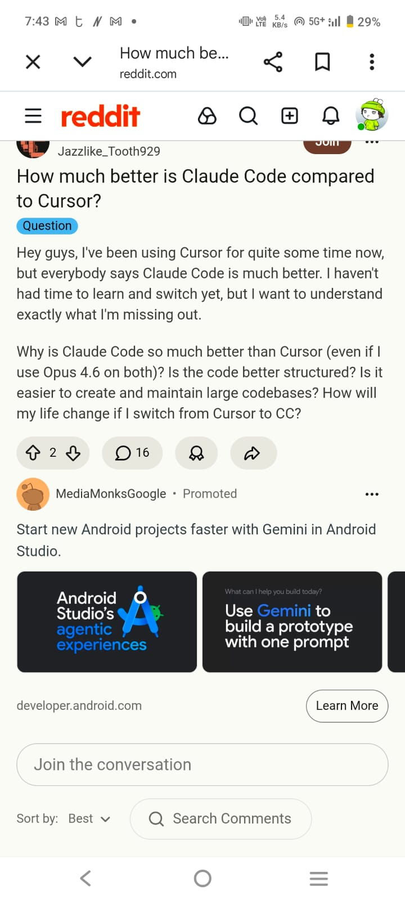
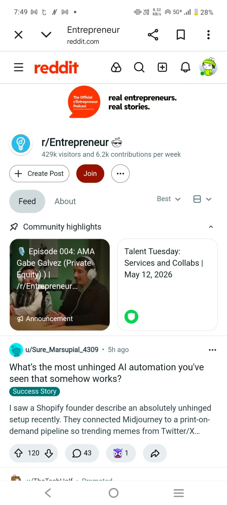
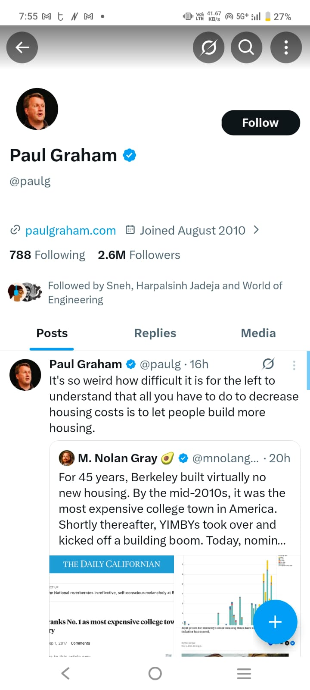

GTM.md

Target user

Engineering manager or CTO at a 10–80 person company who approves Cursor, ChatGPT Team, or GitHub Copilot Business on the corporate card. Finance head or FP&A lead at the same stage who owns the AI line item in the budget and needs a defensible breakdown before renewals. Secondary: solo founder expensing AI tools personally and seeing monthly creep.

What they search right before this

Pricing comparisons (“Cursor vs Copilot pricing,” “ChatGPT Team seats worth it,” “Claude Team minimum seats”) plus Reddit and forum threads where people compare tools and share what they pay—not “AI cost optimizer.” Finance often arrives via those threads or a forwarded link after eng posts in Slack or X when a new invoice lands.

Example (Reddit — tool comparison + comments):

That thread is the moment before someone wants a neutral read on stack cost—not another hot take in the comments.

Where they are online

LinkedIn for role titles and renewals; on X they follow founders and investors (e.g. Paul Graham, Elon Musk) and pick up pricing and AI-stack chatter in replies. On Reddit they hang in r/Entrepreneur and similar subs—long threads on what people pay and automate, not vendor landing pages.

First 100 users in 30 days ($0 paid)

1. Outbound (50): DM ~30 founders who recently posted about AI tool bills; offer a free audit and a public /r/ link only. Target 15 replies, 10 completed audits, 5 forwards to finance or a co-founder.
2. Community (25): One Show HN or Indie Hackers post with methodology and a link to PRICING_DATA.md; invite commenters who share stack details to run the tool.

3. Founder pitch (upside, $0): Ask one high-reach entrepreneur on X—someone they already follow—to run a public audit and share the /r/ link if the savings are real. No sponsorship; the pitch is neutral math, not a product ad.
4. YouTube educators (upside, $0): DM a few large tech-training channels on YouTube and Instagram—e.g. CodeWithHarry, Apna College (Prateek Babbar)—with a short demo and PRICING_DATA.md. Ask for one honest “audit your stack” segment or a pinned description link, not a paid sponsorship; students on personal plans are secondary users who later become founders with real seat counts.

Launch windows: The next time a new AI agent or coding IDE ships, pitch Credex in the comparison threads—people are re-stacking tools and arguing about bills, so a neutral audit lands better than in a quiet week.

Unfair channel

Credex’s credit-buyer and portfolio network can forward neutral, rule-based audits to teams already overspending on retail AI—distribution only works if the audit is credible math, not a sales page.

Week-1 traction if it works

200 audit completions; 40 email captures (~20%); 8 public share links used in Slack or email; 3 consultation conversations from high-savings audits only.
