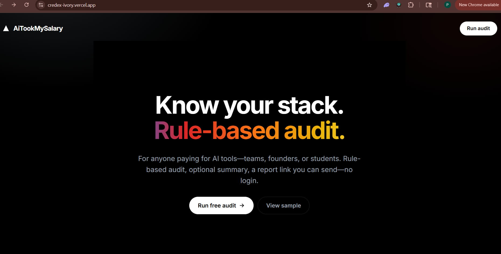
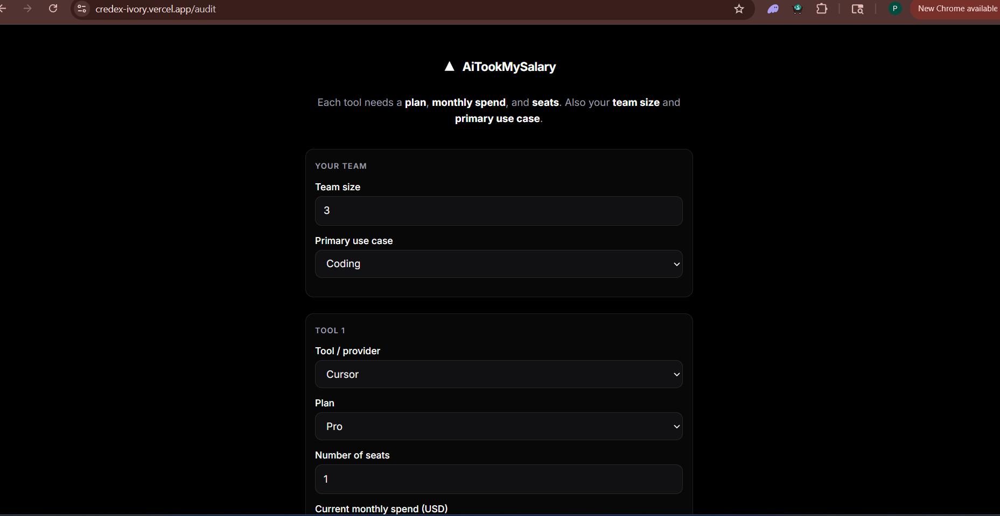
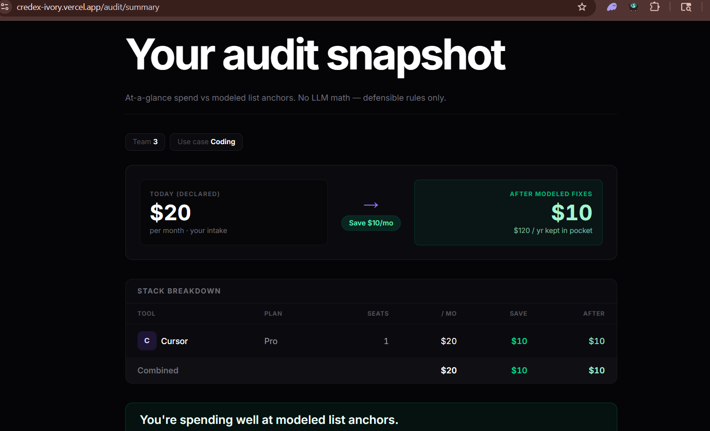

AiTookMySalary

AiTookMySalary is a free web app for founders and engineering leads who pay for AI tools. You enter your stack, plans, seats, and monthly spend; a rule-based engine compares that to cited list pricing and shows modeled savings plus a shareable report. Email capture and an optional summary run after results are shown.

Live app: https://credex-ivory.vercel.app

Screenshots

Landing



Audit intake



Audit summary



Quick start

From the repo root:

```bash
npm install --prefix web
npm run dev
```

Or from web/:

```bash
cd web
npm install
npm run dev
```

Copy web/.env.example to web/.env.local and fill in Supabase, Resend, and any optional LLM keys. Run SUPABASE.sql on your Supabase project before using share links or lead capture.

Production build:

```bash
npm run build --prefix web
npm run start --prefix web
```

Deploy

On Vercel, import this repo, set the root directory to web, and add NEXT_PUBLIC_APP_URL, SUPABASE_URL, and SUPABASE_SERVICE_ROLE_KEY. Add RESEND_API_KEY if you want email. Redeploy after changing environment variables.

Decisions

1. Rules-first audit math, LLM only for narrative — Keeps savings defensible; vendor price changes need updates in PRICING_DATA.md.
2. Supabase for shares and leads — Fast to ship; relies on keeping the service role key server-side only.
3. Client-side audit on the summary page — Instant results; very large stacks might move server-side later.
4. Public share links strip PII — Safe to forward; the public page omits email and company fields.
5. Resend for email — Simple setup; production deliverability improves once you verify a sender domain.
